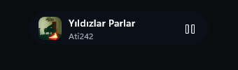
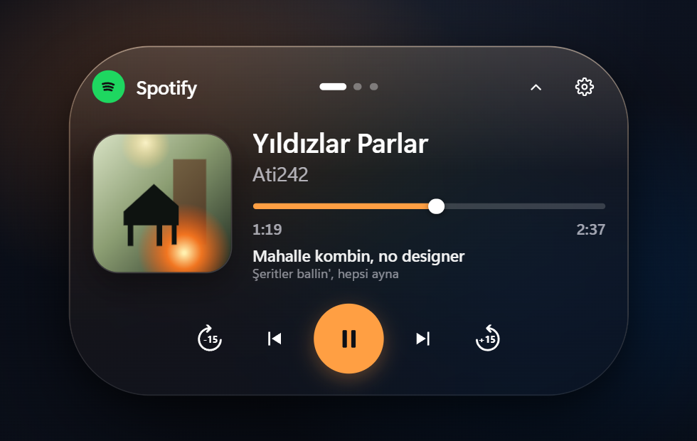
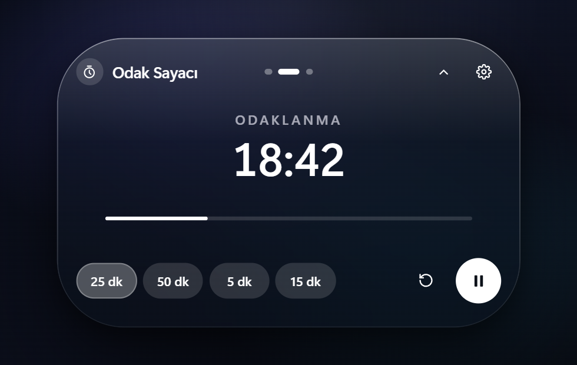
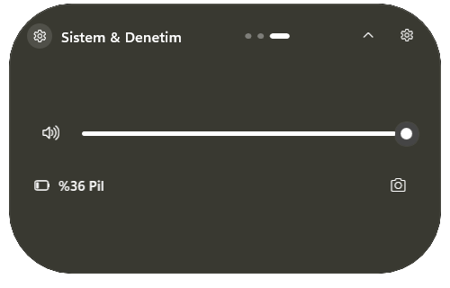
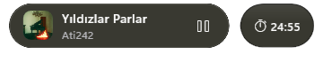
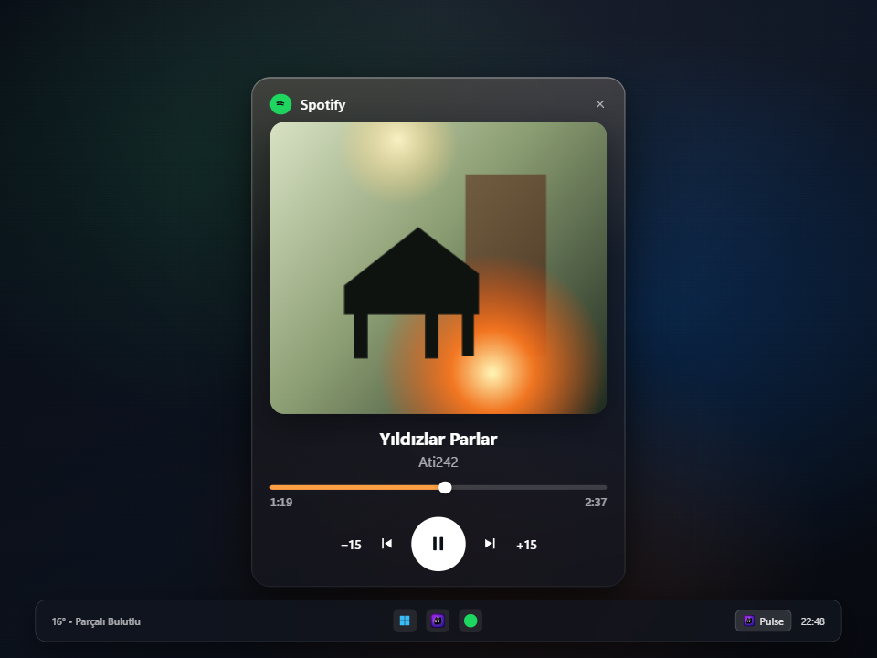
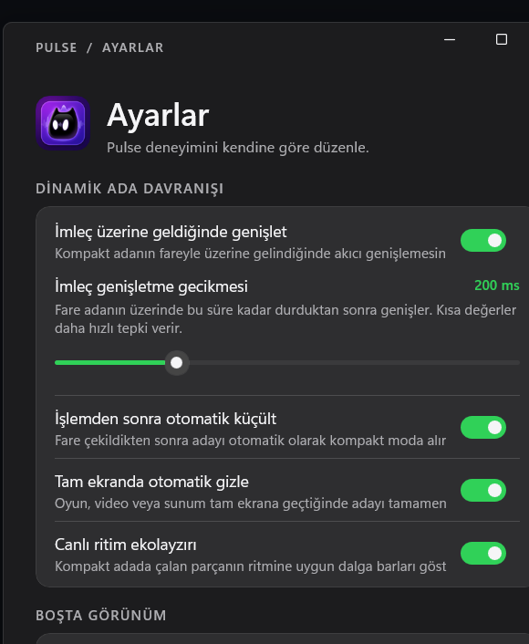
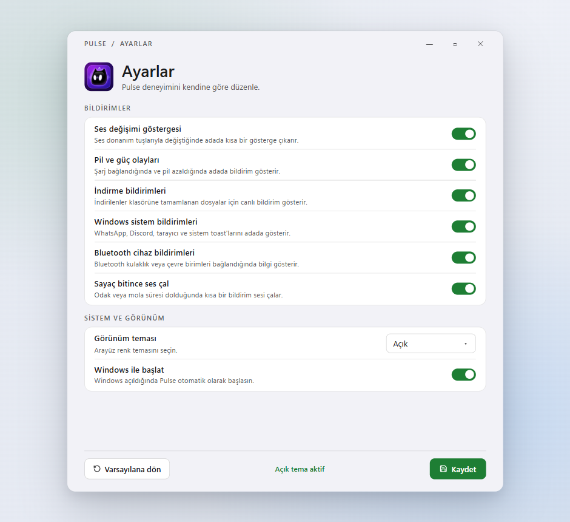

<div align="center">

# Pulse

**A Fluid, Apple iOS Dynamic Island & Media Dashboard for Windows 11**

[](https://dotnet.microsoft.com/)
[](https://learn.microsoft.com/en-us/windows/apps/winui/winui3/)
[](https://github.com/microsoft/windowsappsdk)
[](tests/Pulse.Tests)
[](LICENSE)

*Pulse brings a sleek, GPU-animated Liquid Glass Dynamic Island experience to Windows 11 — combining native system media control, synced lyrics, adaptive album-art frost, a monochrome Pomodoro focus timer, a matching system control panel, a taskbar control center flyout, real-time OS notifications, and a smart idle strip for time, date and weather.*

---

<p>
  
</p>
<p><em><strong>Compact &amp; Live Takeover Pills:</strong> Smart Idle Strip (clock, date &amp; Open-Meteo weather), Compact Media pill with live equalizer and adaptive artwork frost tint, and transient Bluetooth/audio HUD alerts.</em></p>

<br />

<p>
  
</p>
<p><em><strong>Expanded Media Dashboard:</strong> Frosted Liquid Glass backdrop with Fresnel top rim, drag-to-seek timeline, synced lrclib lyrics (current + upcoming line), and Apple-style transport controls. Tap the artwork to jump straight to the source app.</em></p>

<br />

<p>
  
</p>
<p><em><strong>Focus Timer Panel:</strong> Monochrome Pomodoro presets (25/50 min work, 5/15 min break), tabular countdown digits, and a spring-animated progress hairline. Tap the countdown to configure custom durations from 1 to 180 minutes.</em></p>

<br />

<p>
  
</p>
<p><em><strong>System &amp; Control Panel:</strong> Monochrome WASAPI master volume slider with mute toggle, semantic battery telemetry (green charging pulse, red low-battery warning), and one-click screenshot capture.</em></p>

<br />

<p>
  
</p>
<p><em><strong>Split Island:</strong> When media playback and a focus session run concurrently, the island morphs cleanly into paired media and timer capsules. Clicking the detached timer opens the Focus panel.</em></p>

<br />

<p>
  
</p>
<p><em><strong>Taskbar Control Center Flyout:</strong> Tray-anchored frosted media card above the Windows 11 taskbar for fast artwork preview, timeline scrubbing, and playback controls.</em></p>

<br />

<p>
  
</p>
<p><em><strong>Settings (Dark Theme):</strong> Live Dark/Light/System theme switching, damped spring motion profiles (70–140% speed), Liquid Glass transparency slider, island scale, and top floating gap adjustments.</em></p>

<br />

<p>
  
</p>
<p><em><strong>Settings (Light Theme &amp; Notifications):</strong> True Light/Dark visual parity with per-category toggles for hardware volume HUD, power events, completed downloads, Windows toast mirroring, Bluetooth devices, focus chime, and Windows startup registration.</em></p>

---

</div>

## Key Features

- **Zero-Reflow GPU Composition Pipeline**: Smooth multi-state morphing (Idle, Compact, Hover, Expanded, Split, Track Change pulse) driven by `Microsoft.UI.Composition` damped harmonic springs without layout thrashing, framed inside a 3 DIP antialiased `SetWindowRgn` surface and precision rounded clip so pill corners remain sharp across DPI scales.
- **Liquid-Glass Frost Engine**: Toggleable frosted glassmorphism (`LiquidGlassEngine` + `DesktopFrostService`) with a 0–100% transparency slider that samples and blurs the live desktop behind the island, adds an optical Fresnel highlight rim, and blends album-art accent tinting cleanly across Dark, Light, and System themes.
- **Live Theme Switching (Dark / Light / System)**: Instant runtime `RequestedTheme` updates across the Island, Taskbar Flyout, and Settings window without restarting the app.
- **Smart Idle Strip**: When no media is playing, the compact pill displays a live clock, Turkish date, and Open-Meteo local weather (15-minute refresh, automatic `ipwho.is` IP lookup or manually verified city). Clock, date, and weather can each be toggled independently.
- **Live Media Session Control**: Automatic integration with Windows System Media Transport Controls (GSMTC) for Spotify, Apple Music, YouTube, browsers, VLC, and more — featuring dynamic artwork caching, seekable progress bar, ±15s skip controls, and synced lyrics powered by `lrclib`.
- **Taskbar Control Center Flyout**: Click the system tray icon or toggle via context menu to open a taskbar-anchored frosted media card with large album art and transport controls.
- **Split Island**: Concurrent media playback and an active focus countdown automatically split into paired left/right capsules and merge seamlessly when either finishes.
- **Focus Timer (Pomodoro)**: Monochrome preset chips (`25/50` work, `5/15` break), custom duration picker (`1–180` min), tabular countdown digits, session auto-switching, pinned capsule visibility, and optional completion chime.
- **System & Control Panel**: Stepwise WASAPI master volume slider with neutral mute state, live battery & AC charging detection (green while charging with subtle pulse, red when low), and instant screenshot capture saved locally and copied to the clipboard.
- **Real OS Event Awareness**:
  - **Windows Toast Listener**: Surfaces WhatsApp, Discord, browser, and system toast notifications directly inside the island.
  - **Bluetooth Device Alerts**: Announces headset and peripheral connections/battery level via Bluetooth radio monitoring.
  - **Audio, Power, Downloads & Screenshots**: Live hardware volume HUD, AC/charging transitions, completed file detection in Downloads, and instant screenshot alert capsules.
- **Apple-Style Alert Takeover & Deep Links**: Transient alerts briefly take over the pill and hand back to ongoing playback/focus cleanly; tapping artwork opens the source media app, and tapping alert capsules opens their file or folder.
- **Fullscreen & Game Mode Recovery**: Automatically hides for exclusive and borderless fullscreen games (excluding normal maximized windows) and cleanly recovers island/playback state when exiting fullscreen.
- **Single-Instance Guard & Tray Integration**: Re-launching Pulse brings up the existing instance, `--settings` routes directly to a single Settings window, global hotkeys (`Win+Alt+I`, `Win+Shift+F`), unstealable topmost `WM_WINDOWPOSCHANGING` handling, Windows Startup registry management, and full Reduced Motion compliance.
- **Unit Tested Architecture**: Clean MVVM separation with platform-decoupled core state, animation layout, Liquid Glass math, and weather services (**162 automated xUnit tests**).

---

## Architecture & Technology Stack

- **Framework**: .NET 9.0 / C# 13
- **UI Platform**: WinUI 3 (Windows App SDK 2.5.1, unpackaged & self-contained `win-x64`)
- **Rendering & Motion**: `Microsoft.UI.Composition` GPU spring & clip geometry pipeline, DWM transparent host window, `LiquidGlassEngine`, GDI frosted desktop sampling
- **Media & Lyrics**: `Windows.Media.Control.GlobalSystemMediaTransportControlsSessionManager` (GSMTC), `lrclib` synced lyrics client
- **Notifications & System APIs**: `UserNotificationListener` (Windows toasts), Bluetooth radio/device watcher, WASAPI endpoint volume, `GetSystemPowerStatus`, `FileSystemWatcher`, Win32 `SetWindowRgn` & global hotkeys
- **Weather & Location**: Open-Meteo forecast & geocoding APIs, `ipwho.is` IP lookup, JSON disk caches
- **MVVM & Serialization**: `CommunityToolkit.Mvvm`, source-generated `System.Text.Json` contexts
- **Testing**: xUnit with Moq (162 unit tests)

---

## Screens Flow

While expanded, scroll the mouse wheel over the island panel to switch seamlessly between the three pages:

1. **Media** — playback metadata, drag-to-seek timeline, synced lyrics, and transport controls.
2. **Focus Timer** — monochrome Pomodoro focus timer with presets and custom duration picker.
3. **System & Control** — monochrome master volume, semantic charging/low battery status, and screenshot capture.

Clicking the collapsed pill expands the dashboard; clicking outside or pressing the collapse chevron returns to compact mode. Right-click the island or use the tray icon to open Settings, Toggle the Taskbar Flyout, trigger Focus shortcuts, or Hide/Show the island.

---

## Getting Started

### Prerequisites

1. **Windows 10/11** (Build 19041 or newer, recommended Windows 11 Build 26100+)
2. **.NET 9.0 SDK** ([Download .NET 9](https://dotnet.microsoft.com/download/dotnet/9.0))

No Developer Mode or external Windows App Runtime installation is required; the application builds as an unpackaged, self-contained executable.

### Building & Running

Clone the repository and build using the .NET CLI:

```powershell
# Clone the repository
git clone https://github.com/sandrotonal/pulse.git
cd pulse

# Build the solution (Release)
dotnet build Pulse.sln -c Release

# Run automated unit tests (162 tests)
dotnet test tests\Pulse.Tests\Pulse.Tests.csproj -c Release --no-build

# Run the app
dotnet run --project src/Pulse/Pulse.csproj
```

To launch the compiled Release binary directly:

```powershell
.\src\Pulse\bin\x64\Release\net9.0-windows10.0.26100.0\win-x64\Pulse.exe
```

If an instance is already running, stop it cleanly before replacing binaries:

```powershell
Stop-Process -Name Pulse -Force -ErrorAction SilentlyContinue
```

---

## Usage & Controls

- **Mouse Wheel**: switch expanded pages (Media, Focus Timer, System & Control).
- **Click Pill**: toggle the expanded dashboard.
- **Hotkeys**: `Win+Alt+I` shows/hides the island; `Win+Shift+F` starts/pauses the focus timer.
- **Click Artwork**: deep-link to the app currently owning GSMTC playback (Spotify, browser, VLC, etc.).
- **Click Alert Capsule**: open the associated target (screenshot image, Downloads folder, focus panel).
- **Hover**: quick preview with animated live equalizer bars and track details.
- **Right Click / System Tray**: Settings window, Taskbar Flyout, Focus shortcuts, Notification test triggers, Hide/Exit.
- **Theme & Glass**: configure Dark/Light/System theme, 0–100% Liquid Glass transparency, and 0–100% artwork tint strength live in Settings.

---

## Repository Structure

```text
pulse/
├── src/
│   └── Pulse/                      # Main WinUI 3 Application (.NET 9)
│       ├── Controls/               # Custom UI controls (PulseSeekBar)
│       ├── Core/                   # Platform-neutral Core library (Pulse.Core)
│       │   ├── Animation/          # Spring presets, Surface layout & SetWindowRgn pixel math
│       │   ├── Events/             # Pub/sub event models
│       │   ├── Interfaces/         # Service & platform abstractions
│       │   ├── Models/             # Settings, Media, Focus, System & Weather models
│       │   └── Services/           # State machine, LiquidGlassEngine, Downloads, Weather & Settings
│       ├── Services/               # Windows platform integrations
│       │   ├── Artwork/            # Album art extraction & disk cache
│       │   ├── Glass/              # DesktopFrostService behind-island blur sampling
│       │   ├── Lyrics/             # lrclib synced lyrics client
│       │   ├── Media/              # GSMTC media session & playback controller
│       │   └── System/             # Toast listener, Bluetooth, Startup, Screenshot, Tray & WASAPI audio
│       ├── ViewModels/             # MVVM ViewModels (Island, Settings, Flyout)
│       ├── Views/                  # Island, Taskbar Flyout & Settings windows
│       └── Assets/                 # App icons and graphics
├── tests/
│   └── Pulse.Tests/                # xUnit Automated Tests (162 tests)
├── docs/
│   └── images/                     # High-DPI studio screenshots & mockups
├── Pulse.sln                       # Visual Studio / .NET Solution
└── README.md
```

---

## Contributing

Contributions are always welcome. Feel free to open issues, submit pull requests, or request new features.

1. Fork the Project
2. Create your Feature Branch (`git checkout -b feature/AmazingFeature`)
3. Commit your Changes (`git commit -m 'Add some AmazingFeature'`)
4. Push to the Branch (`git push origin feature/AmazingFeature`)
5. Open a Pull Request

---

## License

Distributed under the MIT License. See `LICENSE` for more information.
